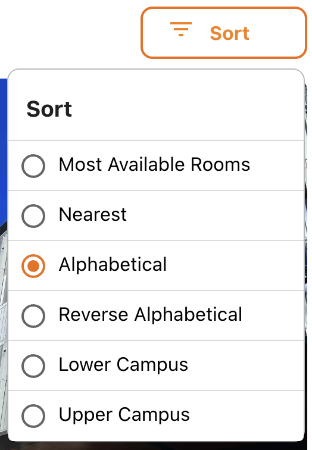
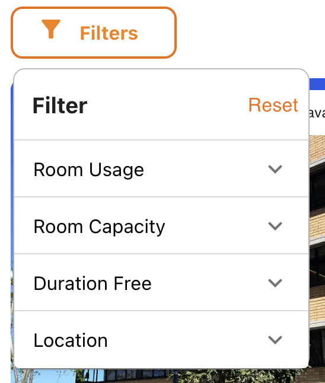
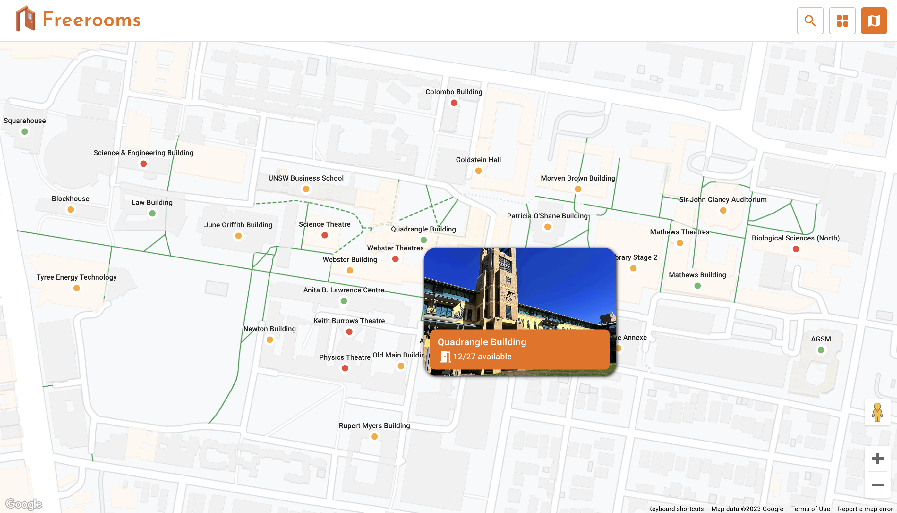
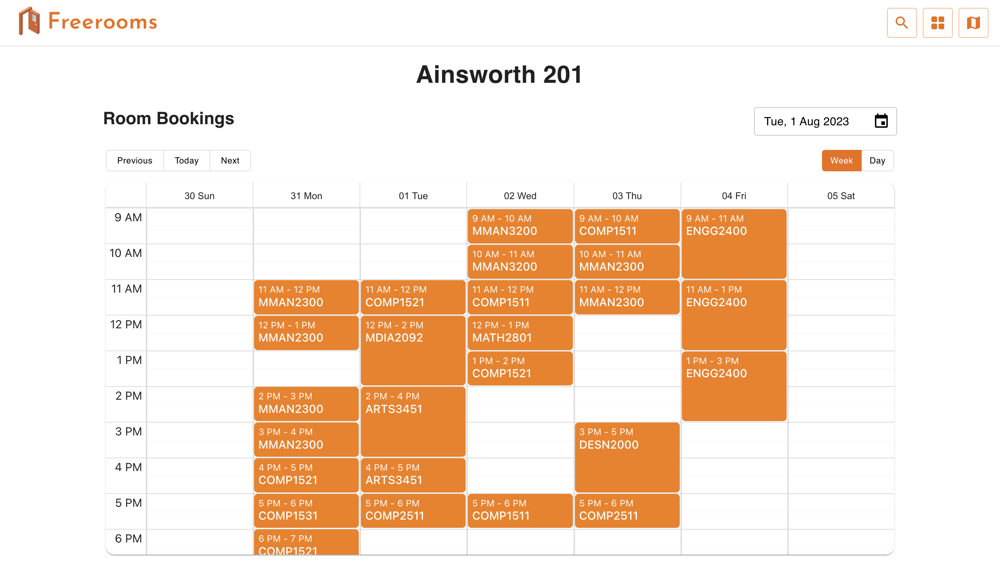
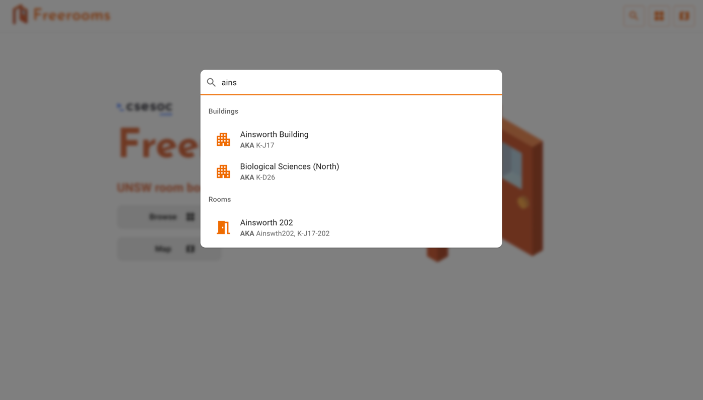

# Freerooms by CSESoc

Freerooms is a tool designed to help UNSW students find empty rooms on campus.

🥾Have you ever wandered around campus, searching for an empty study room?🚪 Have you ever wanted to study somewhere other than the weird smelling ASB🏢, the loud corridors of Ainsworth 🏦 or the poorly decorated main library? 📚 If you are a director or exec, have you ever wanted to find a room for your in-person meetings or society event? Whether you're in need of a quiet study nook or a large space for your society's next big event, Freerooms has got you covered!

🌐💡 We embrace the latest technologies to make Freerooms the best platform out there:
- React/Next.js (frontend)
- React Native (mobile app)
- Node/Express (backend)
- TypeScript (everything)
and more! 🤓👨‍💻

You can find a live build of Freerooms at [https://freerooms.csesoc.app](https://freerooms.csesoc.app/).

## Features

- Check which rooms are free:

- Sort and filter by a range of criteria:

- See which buildings around you have free rooms on the map:

- See the timetable for each room:

- Quickly search for specific buildings or rooms:

## Future Plans

This project is rapidly expanding and our roadmap includes features such as:

- **Detailed Room Information**: Information such as a room's type, how to book it, and all its aliases.
- **Society Bookings**: Use data about society bookings and other bookings besides scheduled classes.
- **Mobile App**: Use Freerooms anytime, anywhere!

# Local Setup

See the [backend](backend), [frontend](frontend) and [app](app) directories for instructions on setting up and running Freerooms locally.

# Our Team

We are a team that is part of CSESoc Development. See [TEAM.md](./TEAM.md) for more information on the current and previous team that contributed to the development of Freerooms.
